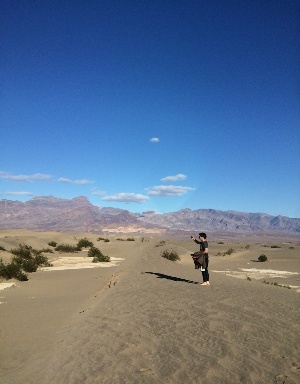
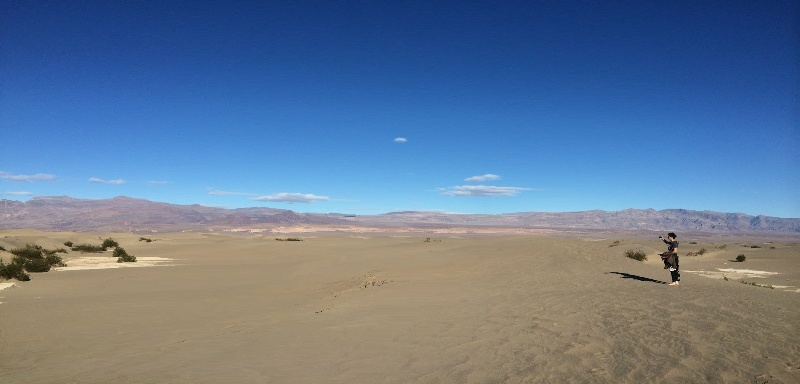
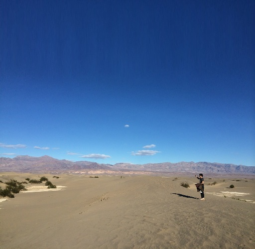
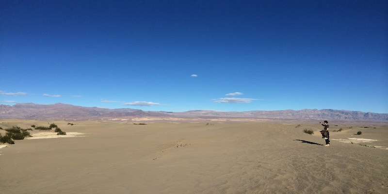
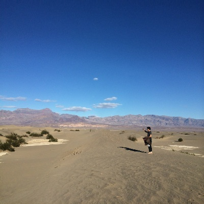
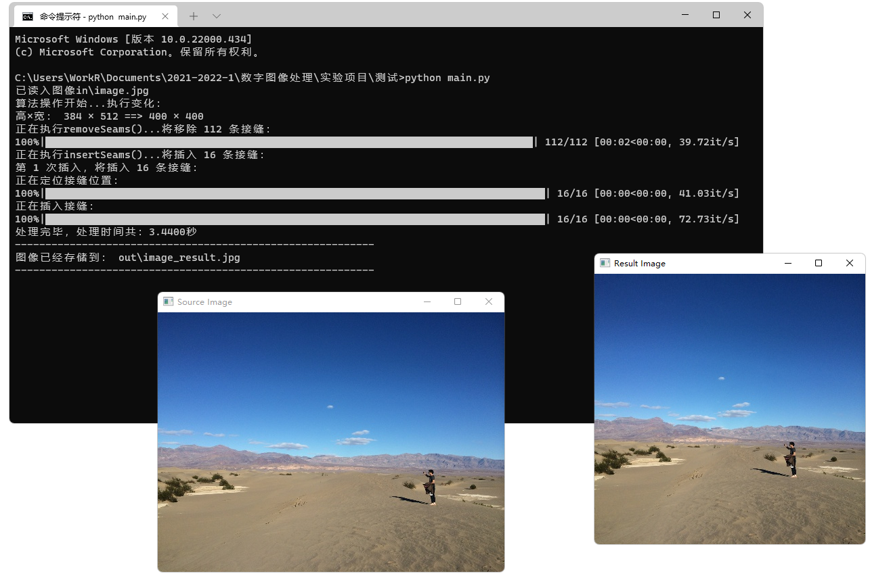

# Seam Carving 算法的 Python 高效实现

[](https://github.com/Razirp) [](https://github.com/Razirp/Seam-Carving-python/blob/main/LICENSE) [](https://cppreference.com/) [](https://opencv.org) [](https://blog.csdn.net/qq_45899276/article/details/138096548?csdn_share_tail=%7B%22type%22%3A%22blog%22%2C%22rType%22%3A%22article%22%2C%22rId%22%3A%22138096548%22%2C%22source%22%3A%22qq_45899276%22%7D)  [](https://github.com/Razirp/Seam-Carving-python/stargazers)

📖 For English users, you can refer to the [English version](README_EN.md)!

> A high-performance python implementation of the Seam Carving algorithm.
>
> 本存储库代码是在 https://github.com/vivianhylee/seam-carving 的基础上实现的，但对性能进行了优化，算法执行速度能够达到前述库中代码的 **20~40 倍**！
> - 具体优化分析见[2.4节](#24-核心技术细节及对前人工作的改进)。

## 一、实验原理

缩放是常见的图像处理操作，只考虑⼏何参数调整并不是最理想的处理⽅式，因为图像中的每个像素的重要程度与图像内容密切相关。

实验要求设计一个算法，输入一张原始图片，输出一张改变长宽比的图像（长宽比可以自行指定）。要求算法必须考虑像素的差异化处理。

本实验使用的 `Seam Carving` 算法[1]可以实现内容感知的图像大小调整——在保持图像重要特征不变的情况下改变图像大小。

- 在缩小图像尺寸时，我们倾向于去掉更多的低能量像素，保留更多的高能量像素
- 在放大图像尺寸时，我们恰当地选择接缝插入的顺序以保证原始图像内容与人工插入像素之间的平衡

### 基本概念

#### 能量函数

使用能量函数定义像素的重要性。

有以下几种类型的能量函数可供选择：

- 梯度幅度
- 熵
- 视觉显著性
- 眼球注视运动

一个简单的基于梯度的能量函数：
$$
e_{1}(I)=\left | \frac{\partial}{\partial x}I \right | + \left | \frac{\partial}{\partial y}I \right |
$$
其中 $I$ 是 $n\times m$ 的图像。

#### 接缝

接缝 `Seam` 指低能量像素从上到下或从左到右穿过图像的连接路径。

- 我们可以通过插入或删除接缝来在水平或垂直方向上改变图像的大小。

设 $I$ 是 $n\times m$ 的图像，定义垂直接缝：
$$
s^{X}=\{s_{i}^{x} \}_{i=1}^{n}=\{(x(i),i) \}_{i=1}^{n},s.t.\ \forall i,\left| x(i)-x(i-1) \right|\le 1
$$
其中，$x$ 是 $[1,...,n]$ 到 $[1,...,m]$ 的映射。也就是说，垂直接缝是图像中像素从上到下的一个 8 -连接路径。每一行包含且仅包含一个像素。

类似地，可以定义水平接缝：
$$
s^{Y}=\{s_{j}^{y} \}_{j=1}^{m}=\{(j,y(j)) \}_{j=1}^{m},s.t.\ \forall j,\left| y(j)-y(j-1) \right|\le 1
$$

> 以上两个定义中的约束都可以根据需要由 $\le 1$ 更改为 $\le k$。

##### 接缝成本

给定能量函数 $e$ ，可以定义接缝成本：
$$
E(s)=E(I_{s})=\sum_{i=1}^{n}e(I(s_{i}))
$$

##### 最佳接缝

我们寻找能使接缝成本最小化的最佳接缝 $s^{*}$：
$$
s^{*}=\min_{s}E(s)=\min_{s}\sum_{i=1}^{n}e(I(s_{i}))
$$
可以利用动态规划方法寻找最佳接缝：

垂直接缝：

- 从第二行遍历图像到最后一行并计算每个 $(i,j)$ 上所有可能连通的接缝的最小累积能量 $M$：
  $$
  M(i,j)=e(i,j)+\min(M(i-1,j-1),M(i-1,j),M(i-1,j+1))
  $$
  $M$ 中最后一行的最小值表示最小竖直接缝的结束。

- 从 $M$ 上的最小条目回溯找到最优接缝的路径。

水平接缝类似，有：
$$
M(i,j)=e(i,j)+\min(M(i-1,j-1),M(i,j-1),M(i+1,j-1))
$$

### 算法步骤

- 算法在移除或插入接缝的过程中无参数
- 用户可以为图像的能量添加权重并指导所需结果

设图像的原始尺寸为 $n\times m$，指定缩放后的图像的尺寸为 $n'\times m'$。设 $r=(m-m')$，$c=(n-n')$，$k=r+c$。

#### 单方向变化

##### 缩减

下面以纵向单方向的尺寸缩减为例，说明算法的基本步骤。

当 $r>0,c=0$ 时，图像横向尺寸不变，纵向尺寸减小，需要删除 $r$ 条水平接缝。此时算法的基本步骤如下：

1. 基于选定的能量函数计算每个像素的能量，得到图像的能量图
2. 利用上文提到的寻找最佳接缝的动态规划方法寻找水平方向的能量最小的接缝 `Seam` 
3. 从图像中移除 `Seam` 对应的所有像素，得到新图像
4. 重复以上步骤 $r$ 次，得到缩放后的图像

##### 放大

对于图像尺寸的缩减，我们只需要依次找到相应的接缝并将其删除即可；但当 $r < 0$ 或 $c<0$ 时，变换后的尺寸会比原尺寸更大，这时要求我们插入人工生成的像素。依照上述算法的基本步骤，我们自然地想到可以在找到能量最小的接缝后，取其左右相邻点的平均复制出一条接缝插入到图像中。但事实上，这种操作不会使被选择的能量最小接缝发生变化，即我们会不断复制同一条接缝产生片拉伸的图像，这并不是理想的结果。

针对图像扩大中引发的这种问题，引文[1]提出了一种解决方案。我们以 $r<0$ 的情况为例，这时我们需要插入 $-r$ 条水平接缝，那么我们可以一次性找到能量前 $-r$ 小的 $-r$ 条接缝，然后复制它们并插入到相应接缝的旁边，这样就可以一次性将图像的尺寸扩大 $-r$ 个单位，达到图像调整的目标。同时，为了避免图像过度放大（如超过50%的幅度）时破坏图像中的重要内容，我们也可以将扩大的过程分为几个步骤，每一步的放大都不会超过前一步的一部分，以保证图像的重要内容不被拉伸。

即扩大时，算法的基本步骤如下（以 $r<0,c=0$ 为例，此时需要插入 $\left| r\right| = -r$ 条接缝）：

1. 设剩余需插入的接缝数为 $r'$。初始值 $r'=-r$

2. 基于选定的能量函数计算每个像素的能量，得到图像的能量图

3. 利用上文提到的寻找最佳接缝的动态规划方法寻找水平方向的能量最小的 $t = \min(r',p)$ 条接缝

   > 这里 $p$ 可以设置为该方向上的尺寸 $m$ 与某个比例常数的积，如 $p=0.5m$

4. 复制找到的接缝插入到图像中，得到新图像， $r'=r'-t$

5. 重复 $2\sim 4$ 步，直到 $r'==0$ 。得到缩放后的图像

#### 两方向同时变化

以上只讨论了图像在一维即单一横向或纵向上的变化。当变化扩大到二维时，我们必须考虑接缝操作的最优顺序：即每一步是选择水平接缝进行操作还是选择垂直接缝进行操作。

##### 基于最优接缝顺序的再定位

最优顺序满足以下函数：
$$
\min_{s^{x},s^{y},\alpha} \sum_{i=1}^{k}E(\alpha_{i}s_{i}^{x}+(1-\alpha_{i})s_{i}^{y})
$$
其中 $\alpha_{i}$ 指示第 $i$ 步需要删除垂直接缝或水平接缝。$k=r+c$，$r=(m-m')$，$c=(n-n')$。

可以采用动态规划解决：
$$
T(r,c)=\min(T(r-1,c)+E(s^{x}(I_{(n-r-1)\times(m-c)})),T(r,c-1)+E(s^{y}(I_{(n-r)\times(m-c-1)})))
$$
$T(r,c)$ 指示获取大小为 $(n-r)\times(m-c)$ 的图像所需的最小代价。其中 $T(0,0)=0$。

存储动态规划每一步的选择，从 $T(r,c)$ 回溯到 $T(0,0)$ 即可确定接缝的最优操作顺序。

## 二、实验步骤

### 2.1 了解实验原理

通过学习文献[1]并参考若干网络博客，学习图像缩放相关的常见技术以及 Seam Carving 方法的优势和基本原理。

### 2.2 配置实验环境

本次实验的实验环境如下：

- Windows 11 专业版 21H1
- Python 3.8.5
- OpenCV-Python 4.5.5.62
- NumPy 1.20.1
- tqdm 4.62.3
- PyCharm 2021.2.2 Community Edition

### 2.3 算法流程设计

本报告的第一部分已经对实验采用的算法的基本思想做了简要的介绍。这一部分将主要介绍算法通过 `Python` 代码实现的算法的基本流程，但不触及技术细节。关于能量图处理等算法的核心概念细节以及实验中对前人工作的改进将在 2.4 节深入介绍。

为了便于程序的使用和维护，本次实验将算法的实现包装在了一个类 `SeamCarver` 中。以下方法均是类 `SeamCarver` 中的方法。

#### 初始化

方法 `__init__` 是解决方案的入口部分，将根据输入的参数初始化对象，并调用算法模块开始进行图像裁剪：

```python
def __init__(self, inputPath, targetHeight, targetWidth):
    """
    初始化字段，得到目标图像。

    Parameters:
    ----------
    :param inputPath: 输入图像的存放路径
    :param targetHeight: 目标高度
    :param targetWidth: 目标宽度
    """
    self.srcImage = cv2.imread(inputPath).astype(np.double)  # 获得输入的源图像
    if self.srcImage is None:
        print("读取图像失败")
        exit(1)
    else:
        print("已读入图像" + inputPath)

    # 初始化字段
    self.targetHeight = targetHeight
    self.targetWidth = targetWidth
    self.tempImage = np.copy(self.srcImage)  # 算法的操作将在复制出的tempImage上进行

    self.energyMap = None  # 初始化能量图为None

    self.start()  # 进行算法操作
```

#### 根据尺寸决定裁剪方案

方法 `__init__` 的最后调用了方法 `start()` 。`start()` 将根据输入的目标尺寸决定裁剪需采用的算法方案：

``` python
def start(self):
    """
    Seam Carving 算法的开始部分。
    根据图像尺寸的变化要求选择不同的操作步骤：
    当只有一个方向的尺寸发生变化时，选择一维操作（行方向或列方向），否则选择二维操作。
    - 列方向指处理的接缝为纵向的
    - 行方向指处理的接缝为横向的

    :return: 没有返回值。
    """
    print("算法操作开始...执行变化：")
    print("高×宽：", self.srcImage.shape[0], "×", self.srcImage.shape[1], "==>", self.targetHeight, "×",
          self.targetWidth)
    startTime = time.time()
    delta_rows, delta_cols = int(self.targetHeight - self.srcImage.shape[0]), \
                             int(self.targetWidth - self.srcImage.shape[1])

    if delta_cols == delta_rows == 0:  # 若没有变化，则无需操作
        pass
    elif delta_cols == 0:  # 若列方向变化为 0，则只需要处理行方向
        self.rowsSeamCarve(delta_rows)
    elif delta_rows == 0:  # 若行方向变化为 0，则只需要处理列方向
        self.colsSeamCarve(delta_cols)
    else:  # 否则需同时处理两个方向
        self.twoDimSeamCarve(delta_rows, delta_cols)
    endTime = time.time()
    print("处理完毕，处理时间共：%.4f秒" % (endTime - startTime))
    print("-----------------------------------------------------------")
```

#### 三种裁剪方案

- `colsSeamCarve()`
  - 这是主要的裁剪方案，其余两个裁剪方案都以裁剪竖直接缝的方案为基础。

```python
def colsSeamCarve(self, delta_cols):
    """
    仅列数发生变化的情况。将在tempImage中增加delta_cols（若为负则减少）条列方向接缝。

    :param delta_cols: 需要增加的列方向接缝的数量。允许为负，代表减少接缝。
    :return: 没有返回值。
    """
    if delta_cols < 0:  # 列数变化小于零，说明列数减少，需要移除相应数量的列接缝
        self.removeColSeams(-delta_cols)
    elif delta_cols > 0:  # 列数变化大于零，说明列数增加，需要插入相应数量的列接缝
        self.insertColSeams(delta_cols)
```

- `rowsSeamCarve()`
  - 通过转置将问题转化为对竖直接缝的处理，最后再通过转置反变化回原来的问题域得到预期的结果。

```python
def rowsSeamCarve(self, delta_rows):
    """
    仅行数发生变化的情况。将在tempImage中增加delta_rows（若为负则减少）条行方向接缝。

    - 通过将图像转置然后调用colsSeamCarve()解决。

    :param delta_rows: 需要增加的行方向接缝的数量。允许为负，代表减少接缝。
    :return: 没有返回值。
    """
    self.energyMap = None  # 清空能量图信息，以使能量图得以被重新计算
    self.tempImage = self.tempImage.swapaxes(0, 1)  # 转置图像
    self.colsSeamCarve(delta_rows)  # 在转置图中操作列，实现在原图中操作行的效果
    self.tempImage = self.tempImage.swapaxes(0, 1)  # 将图像转置回来
    self.energyMap = None  # 清空能量图信息，以使能量图得以被重新计算
```

- `twoDimSeamCarve()`
  - 分别调用以上两个方法，先进行列变换再进行行变换。

```python
def twoDimSeamCarve(self, delta_rows, delta_cols):
    """
    两方向同时发生变化的情况，先处理列变化再处理行变化。

    :param delta_rows: 需要增加的行方向接缝的数量。允许为负，代表减少接缝。
    :param delta_cols: 需要增加的列方向接缝的数量。允许为负，代表减少接缝。
    :return: 没有返回值
    """
    self.colsSeamCarve(delta_cols)
    self.rowsSeamCarve(delta_rows)
```

#### 竖直接缝的处理

从上一部分可以看出，对于竖直接缝的处理是算法的主要部分，是所有情况的基础。

根据尺寸的扩大或者缩小，我们可能插入或删除竖直接缝。

##### 删除接缝

每一次循环都进行能量图检查、找到能量最小的接缝并删除接缝三步，每一次循环可以删除一条接缝。

```python
def removeColSeams(self, num_seamsRemoved):
    """
    在tempImage中移除num_seamsRemoved条列方向（竖直）接缝。

    :param num_seamsRemoved: 需要被移除的接缝数量。
    :return: 没有返回值。
    """
    print("正在执行removeSeams()...将移除", num_seamsRemoved, "条接缝：")
    for i in tqdm(range(num_seamsRemoved), file=sys.stdout):  # 循环移除接缝
        self.checkEnergyMap()  # 检查能量图，确保能量图有效。
        seamToRemove = self.get_seamToRemove_col()  # 得到将要移除的接缝（总能量最小的）
        self.doColSeamRemoval(seamToRemove)  # 从tempImage中移除相应接缝
```

##### 插入接缝

关于插入接缝的部分，引文[1]中给出的建议是分多次插入，每次一次性找到能量最低的前 $k$ 条接缝进行插入。

- 程序中将对需要插入的接缝条数进行判断，若超出相应尺寸的一定比例，就会选择分多次进行插入
- 在每次单独的插入中，都会先定位接缝的位置，然后再进行插入：
  - 先在临时图中依次删去 $k$ 条接缝，记录下被删除的接缝的位置，作为选中的 $k$ 条接缝
    - 因为每选中一条接缝都会将其从原图中删去，所以能够保证找到的这 $k$ 条接缝像素互不重叠
    - 因为每次被选中的都是剩余图像中能量最小的接缝，所以能够保证找出的这 $k$ 条接缝就是原图中能量最小的 $k$ 条接缝
    - 每次删除接缝都会改变图像结构，可能导致接缝的记录出现偏差，需要在插入时动态地进行修正
  - 然后再在原图中根据上一步记录的位置进行插入操作
    - 由于上面第三条提出的接缝记录偏差的问题，接缝插入的顺序必须与上一步接缝被删除的顺序保持一致
    - 由于上面第三条提出的接缝记录偏差的问题，每插入一条接缝，所有剩余接缝的记录都需要被动态地更新一次

```python
def insertColSeams(self, num_seamsInserted):
    """
    判断是否需要多次插入：
    - 当扩大的比例超过原尺寸的p倍时，将分多次插入，每次插入的规模是之前的0.8倍，直到达到要求。

    :param num_seamsInserted: 需要插入的接缝数量。
    :return: 没有返回值。
    """
    p = 0.3
    limit = int(p * self.tempImage.shape[1])  # 限制一次最多插入的接缝数
    insertedNum = 0
    print("正在执行insertSeams()...将插入", num_seamsInserted, "条接缝：")
    count = 0
    while insertedNum < num_seamsInserted:
        count += 1
        curInsertNum = min(limit, num_seamsInserted - insertedNum)  # 计算本次需要插入的条数
        print("第", count, "次插入，将插入", curInsertNum, "条接缝：")
        self.insertColSeams_sub(curInsertNum)  # 插入
        limit = max(1, int(limit * 0.8))  # 更新限制
        insertedNum += curInsertNum

def insertColSeams_sub(self, num_seamsInserted):
    """
    在tempImage中插入num_seamsInserted条列方向（竖直）接缝。
    
    :param num_seamsInserted: 需要插入的接缝数量。
    :return: 没有返回值。
    """

    seamsQueue = []  # 存放所需插入的接缝
    copiedImage = np.copy(self.tempImage)  # 暂存tempImage的初始状态

    # 通过依次删除num_seamsInserted条接缝，找到总能量前num_seamsInserted小的接缝存于seamsQueue中

    print("正在定位接缝位置：")
    for i in tqdm(range(num_seamsInserted), file=sys.stdout):
        self.checkEnergyMap()  # 检查能量图，确保能量图有效。
        seamToRemove = self.get_seamToRemove_col()  # 得到将要移除的接缝（总能量最小的）
        seamsQueue.append(seamToRemove)  # 记录下相应的接缝
        self.doColSeamRemoval(seamToRemove)  # 从tempImage中移除相应接缝

    self.tempImage = np.copy(copiedImage)  # 恢复tempImage为初始状态
    self.energyMap = None  # 清空能量图，指示下一次需重新计算能量图。

    print("正在插入接缝：")
    # 依照seamsQueue中记录的接缝位置依次将接缝插入到图中，并实时更新seamsQueue
    for i in tqdm(range(num_seamsInserted), file=sys.stdout):
        seamToInsert = seamsQueue.pop(0)  # 取队列头对应的接缝进行插入
        self.doColSeamInsertion(seamToInsert)  # 插入接缝
        seamsQueue = self.updateSeamsQueue(seamsQueue, seamToInsert)  # 更新seamsQueue
```

### 2.4 核心技术细节及对前人工作的改进

在核心技术细节的实现上，我参考了包括引文[1]和作业给出的代码（https://github.com/vivianhylee/seam-carving） 在内的资料，并且在多个部分尝试进行了改进。有的改进是算法层面的，在一定程度上降低了算法的时间复杂度；有的改进则是针对 `Python` 语言的特点做出的，是工程实现层面的改进：

- 改进了能量图的计算和处理方式，降低了能量图处理的时间复杂度
- 改进了动态规划的代码实现方案，极大地提高了程序的运行速度
- 充分利用了 `Python` 和 `NumPy` 对多维数组处理的优越性，简化了代码的书写方式，减少了代码量，使代码更加简洁并提高了运行效率

> 因为算法主要部分是针对竖直接缝编写的（见 2.3 - 三种裁剪方案），所以以下所有提到的“接缝”都是指竖直接缝。

#### 能量图

图像能量图的计算是 `Seam Carving` 算法尤其是接缝移除部分的重要环节。引文[1]中给出了多个不同的能量函数，主要以两方向梯度绝对值的和为主。

本实验中参考给出的[代码](https://github.com/vivianhylee/seam-carving)的方案，利用 `cv2.Scharr` 算子对图像进行滤波得到能量图。并且充分利用了`Python` 语言及 `NumPy` 库对多维数组处理便捷的语言特性，避免了[代码](https://github.com/vivianhylee/seam-carving)中使用 `cv2.split()` 分离图像为 B、G、R 三个通道的步骤，**节省了处理时间**并且使得代码**更加简洁**：

> `OpenCV` 官方文档中指出：
>
> `cv.spilt()` 是一项代价高昂的操作（就时间而言）。所以只有在你需要时才这样做，否则就使用 `NumPy` 索引。

```python
self.energyMap = np.absolute(cv2.Scharr(self.tempImage, -1, 1, 0)).sum(2) + \
                 np.absolute(cv2.Scharr(self.tempImage, -1, 0, 1)).sum(2)
```

同时，在引文[1]以及作业给出的[代码](https://github.com/vivianhylee/seam-carving)中采取的方案都是每一次移除一条接缝后都重新对全图进行计算生成一个新的能量图。但事实上，`cv2.Scharr` 算子使用 $3\times 3$ 的模板，所以删除一条接缝至多只会影响其左右各 1 个单位像素的能量值，图像中其余大部分像素的能量都不会受到影响。因此算法在这一点上有着很大的优化空间：若每次只更新能量图中接缝周围的部分，那么就可以将能量图更新的**时间复杂度**由 $O(mn)$ **降低**到 $O(m)$。

笔者考虑以空间换时间，分配一个字段 `self.energyMap` 专门存储能量图，这样只需要在每一次删除接缝后对能量图进行相应的更新即可。

笔者首先尝试了根据每一次删除的接缝定位需要更新的像素的位置，然后依次对每一个像素的能量进行重新计算的方法。但是这样的方法需要大量的迭代循环。考虑到 `Python` 语言迭代的低效率（这一点将在下一小节中体现得尤为明显），这并不是很好的优化方案。故笔者退而求其次，采用对图像的一部分使用 `cv2.Scharr` 算子重新滤波计算的方法。因为 `cv2.Scharr()` 的底层代码采用 `C/C++` 编写，其迭代运算效率将显著高于 `Python`。

算法将在每次更新时重新滤波接缝最左端向外一单位到接缝最右端向外一单位的图像。考虑到竖直接缝一般在横向的跨度不会很大，这依然可以显著降低算法的时间复杂度，并且很好地兼顾了 `C/C++` 语言迭代效率高的特点：

```python
def updateEnergyMap(self, removedSeam):
    """
    在每次移除接缝之后根据图像变化更新能量图。
    - 利用 cv2.Scharr 算子对接缝左右边界（各向外扩大一格）之间的图像区域重新进行滤波。

    :param removedSeam: 被移除的接缝。指示图像发生的变化。
    :return: 没有返回值。
    """
    colLimit = self.tempImage.shape[1]  # 图像列边界

    leftLimit, rightLimit = max(0, np.amin(removedSeam) - 1), \
                            min(colLimit, np.amax(removedSeam) + 1)  # 需要重新滤波的区域的边界（左闭右开）

    self.energyMap = np.delete(self.energyMap, leftLimit, 1)  # 从energyMap中移除一列，实现更新能量图形状的效果

    scharrLeftLimit, \
    scharrRightLimit = max(0, leftLimit - 1), \
                       min(colLimit, rightLimit + 1)  # 滤波算子需要读入的区域的边界。通常比需要重新滤波的边界左右各宽1个单位。

    tempMap = np.absolute(cv2.Scharr(self.tempImage[:, scharrLeftLimit:scharrRightLimit, :], -1, 1, 0)).sum(2) + \
              np.absolute(cv2.Scharr(self.tempImage[:, scharrLeftLimit:scharrRightLimit, :], -1, 0, 1)).sum(2)  # 滤波算子结果

    # 根据情况裁剪滤波算子结果得到有效部分更新到能量图中
    if leftLimit == 0 and rightLimit == colLimit:
        self.energyMap[:, leftLimit:rightLimit] = np.copy(tempMap)
    elif leftLimit == 0:  # 左边界到头，只需将最后一列裁去
        self.energyMap[:, leftLimit:rightLimit] = tempMap[:, :-1]
    elif rightLimit == colLimit:  # 右边界到头，只需将第一列裁去
        self.energyMap[:, leftLimit:rightLimit] = tempMap[:, 1:]
    else:  # 一般情况下需要左右各裁去一列
        self.energyMap[:, leftLimit:rightLimit] = tempMap[:, 1:-1]
```

这样，在每次执行接缝删除操作前就无需重新计算一次能量图，而只是调用 `checkEnergyMap` 检查一下能量图是否可用即可：

```python
def checkEnergyMap(self):
    """
    检查能量图是否可用，若不可用则重新计算能量图。
    :return: 没有返回值。
    """
    if self.energyMap is None:  # 如果没有计算过梯度图，则进行初始化计算
        self.energyMap = np.absolute(cv2.Scharr(self.tempImage, -1, 1, 0)).sum(2) + \
                         np.absolute(cv2.Scharr(self.tempImage, -1, 0, 1)).sum(2)
```

#### 寻找总能量最小的接缝

在接缝移除中，最核心的部分就是寻找最小能量接缝的算法。论文[1]提出采用动态规划的方式解决这一问题。作业给出的[代码](https://github.com/vivianhylee/seam-carving)中给出了动态规划的一种实现：

```python
# 这是作业给出的代码中的实现，仅作为对比参考，不是本实验采用的方案。
def cumulative_map_backward(self, energy_map):
    m, n = energy_map.shape
    output = np.copy(energy_map)
    for row in range(1, m):
        for col in range(n):
            output[row, col] = \
                energy_map[row, col] + np.amin(output[row - 1, max(col - 1, 0): min(col + 2, n - 1)])
    return output
```

在算法层面上，这一实现没有问题，完全符合论文[1]中的描述。但是可以看到，代码中出现了 `Python` 下的双层迭代循环。考虑到 `Python` 迭代运算的低效率，这样的写法可能会显著增加程序的运行时间。此外，笔者在与同学的交流中得知，作业给出的[代码](https://github.com/vivianhylee/seam-carving)的运行速度大大慢于其用 `C++` 语言实现的程序的运行速度；而经笔者测试，算法中耗时最长的部分就是动态规划的这一部分：每删除一条接缝平均耗时约 1 秒，而动态规划步骤耗时可以达到 $0.8\sim 0.9$ 秒。因此，笔者决定从这一双循环迭代入手，尝试优化程序的运行速度。

这一问题由 `Python` 语言迭代的低效率引起，那么自然的想法就是尝试将更多的运算工作转移到 `C/C++` 环境下运行。考虑到 `NumPy` 库的底层实现采用 `C/C++`，而动态规划时每一行的结果都仅与上一行有关，所以笔者尝试利用 `NumPy` 库对动态规划矩阵的每一行进行整体处理，以减少一层迭代循环：

```python
def getDPMap_colSeams(self):
    """
    得到计算纵向接缝的动态规划图。

    :return: 计算纵向接缝的动态规划图。
    """
    dpMap = np.copy(self.energyMap)  # 动态规划图与能量图同形，在能量图基准上累加
    # 从第二行遍历到最后一行
    for row in range(1, self.energyMap.shape[0]):
        left = np.concatenate((dpMap[row - 1, 1:], [np.inf]), axis=0)  # 上一行左移
        right = np.concatenate(([np.inf], dpMap[row - 1, :self.energyMap.shape[1] - 1]), axis=0)  # 上一行右移
        dpMap[row, :] += np.amin((left, dpMap[row - 1, :], right), axis=0)  # 取上一行左中右三个值中的最小值与当前行累加
    return dpMap
```

经测试，优化后的代码的运行速度比原代码提升了 $20\sim 40$ 倍，极大地**提升了算法的运行速度**。

对得到的动态规划图进行回溯，即可确定总能量最小的接缝：

```python
def findOptimalSeam_col(self, dpMap):
    """
    由dpMap回溯得到总能量最小的纵向接缝的索引列表。

    :param dpMap: 计算接缝得到的动态规划图。
    :return: 总能量最小的纵向接缝的索引列表。
    """
    seamIndex = np.zeros((dpMap.shape[0],), dtype=np.uint32)  # 初始化接缝的索引列表
    seamIndex[-1] = np.argmin(dpMap[-1, :])  # 取最小总能量对应的索引开始回溯
    for row in range(dpMap.shape[0] - 2, -1, -1):  # 从倒数第二行开始倒序遍历到第一行
        preIndex = seamIndex[row + 1]
        seamIndex[row] = max(preIndex - 1, 0) + \
                         np.argmin(dpMap[row,
                                   max(preIndex - 1, 0):
                                   min(preIndex + 2, dpMap.shape[1])])  # 注意“:”右边取不到
    return seamIndex
```

#### 在图像中移除或插入接缝

移除和插入接缝的算法操作相似，都是遍历更新图像的每一行，在接缝对应位置进行相应的删除或插入操作。

对比[代码](https://github.com/vivianhylee/seam-carving)，本实验充分利用了 `Python` 和 `NumPy` 对多维数组处理的优越性，简化了代码的书写方式，减少了代码量，使代码更加**简洁**并**提高了运行效率**：

```python
def doColSeamRemoval(self, seamToRemove):
    """
    从tempImage中移除seamsToRemove所指示的竖直接缝。

    :param seamToRemove: 需要移除的接缝的索引列表。
    :return: 没有返回值。
    """
    newImage = np.zeros((self.tempImage.shape[0],
                         self.tempImage.shape[1] - 1,
                         self.tempImage.shape[2]))
    for row in range(self.tempImage.shape[0]):  # 遍历更改每一行
        newImage[row, :, :] = np.delete(self.tempImage[row, :, :], seamToRemove[row], 0)  # 移除相应索引处的像素
    self.tempImage = np.copy(newImage)  # 更新图像
    self.updateEnergyMap(seamToRemove)  # 更新能量图


def doColSeamInsertion(self, seamToInsert):
    """
    在seamToInsert处插入一条新的接缝，像素值取左右像素值的平均值。

    :param seamToInsert: 需要插入的接缝的索引列表。
    :return: 没有返回值
    """
    newImage = np.zeros((self.tempImage.shape[0],
                         self.tempImage.shape[1] + 1,  # 增加1列
                         self.tempImage.shape[2]))
    for row in range(self.tempImage.shape[0]):  # 遍历更改每一行
        curCol = seamToInsert[row]  # 当前需操作的列
        newPixel = np.average(self.tempImage[row, curCol:curCol + 2, :], 0)  # 新像素值取seam和其后一个像素的平均值
        newImage[row, :, :] = np.insert(self.tempImage[row, :, :], curCol, newPixel, 0)  # 在相应位置插入新像素
    self.tempImage = np.copy(newImage)  # 更新图像
```

根据算法需要，在移除接缝后需要调用 `updateEnergyMap()` 更新能量图。在插入接缝后，则需要更新剩余需要插入的接缝的索引：

> 详见 2.3 - 竖直接缝的处理 - 插入接缝。

```python
def updateSeamsQueue(self, seamsQueue, lastInsertedSeam):
    """
    根据最近被插入的接缝更新seamsQueue中的坐标并返回。

    :param seamsQueue: 需要被更新的seamsQueue，存储了一系列接缝索引。
    :param lastInsertedSeam: 上一个被插入的接缝的索引。
    :return: 新的seamsQueue。
    """
    newSeamsQueue = []
    for seam in seamsQueue:  # 遍历更新每一个seam
        seam[np.where(lastInsertedSeam <= seam)] += 2  # 当上一个接缝插入到seam左侧时，将seam自增2（包括新插入的像素和其对应的原图中的像素）
        newSeamsQueue.append(seam)
    return newSeamsQueue
```

### 2.5 程序运行与算法测试

`main.py` 中提供了运行程序测试算法的示例：

```python
import os.path
import cv2
from SeamCarving import SeamCarver

if __name__ == '__main__':

    # 输入输出目录。运行前需保证以下两个文件夹在根目录中存在
    folder_in = "in"  # 输入的图片需存放在 ./in 中
    folder_out = "out"  # 输出的图片将存放在 ./out 中

    # 输入文件名和输出文件名，用户可自定义以下四个字段
    imageName_input = "image.jpg"  # 输入的图片的文件名
    imageName_output = "image_result.jpg" # 输出的图片的文件名

    target_height = 400  # 缩放后图像的目标高度
    target_width = 400 # 缩放后图像的目标宽度

    # 输入输出的路径
    inputPath = os.path.join(folder_in, imageName_input)  # 输入图像的路径
    outputPath = os.path.join(folder_out, imageName_output)  # 输出图像的路径

    resizer = SeamCarver(inputPath, target_height, target_width)  # 实例化算法类，执行算法
    resizer.saveResultImage(outputPath)     # 保存结果图到目标路径

    srcImage = resizer.getSrcImage()    # 得到原图
    retImage = resizer.getResultImage() # 得到结果图

    cv2.imshow("Source Image", srcImage)    # 显示原图
    cv2.imshow("Result Image", retImage) # 显示结果图
    cv2.waitKey(0)
```

## 三、实验结果与分析

### 输入

输入图像如下，其原始尺寸为：高×宽 = 384 × 512


### 输出

#### 1. 单方向尺寸变化

> 以下结果图只有一个方向的尺寸发生了变化，另一个方向的尺寸保持不变。

- 列减少，行不变——高×宽： 384 × 512 ==> 384 × 300

  

- 列增加，行不变——高×宽： 384 × 512 ==> 384 × 800

  

- 行减少，列不变——高×宽： 384 × 512 ==> 200 × 512

  

- 行增加，列不变——高×宽： 384 × 512 ==> 500 × 512

  

#### 2. 多方向尺寸变化

> 以下结果图两个方向的尺寸都发生了变化。

- 行增加，列增加：高×宽： 384 × 512 ==> 400 × 800

  

- 行增加，列减少：高×宽： 384 × 512 ==> 400 × 400

  

- 行减少，列增加：高×宽： 384 × 512 ==> 300 × 700

  

- 行减少，列减少：高×宽： 384 × 512 ==> 250 × 350

  

#### 3. 程序打印输出

本实验在程序中加入了可视化输出，以实时向用户展示算法运行的情况。执行以上操作时的程序的打印输出如下：

```
已读入图像in\image.jpg
算法操作开始...执行变化：
高×宽： 384 × 512 ==> 384 × 300
正在执行removeSeams()...将移除 212 条接缝：
100%|██████████| 212/212 [00:07<00:00, 26.57it/s]
处理完毕，处理时间共：7.9979秒
-----------------------------------------------------------
图像已经存储到： out\image_0_re.jpg
-----------------------------------------------------------
算法操作开始...执行变化：
高×宽： 384 × 512 ==> 384 × 800
正在执行insertSeams()...将插入 288 条接缝：
正在定位接缝位置：
100%|██████████| 288/288 [00:07<00:00, 38.64it/s]
正在插入接缝：
100%|██████████| 288/288 [00:05<00:00, 49.82it/s]
处理完毕，处理时间共：13.2346秒
-----------------------------------------------------------
图像已经存储到： out\image_0_en.jpg
-----------------------------------------------------------
算法操作开始...执行变化：
高×宽： 384 × 512 ==> 200 × 512
正在执行removeSeams()...将移除 184 条接缝：
100%|██████████| 184/184 [00:05<00:00, 34.54it/s]
处理完毕，处理时间共：5.3268秒
-----------------------------------------------------------
图像已经存储到： out\image_re_0.jpg
-----------------------------------------------------------
算法操作开始...执行变化：
高×宽： 384 × 512 ==> 500 × 512
正在执行insertSeams()...将插入 116 条接缝：
正在定位接缝位置：
100%|██████████| 116/116 [00:03<00:00, 33.43it/s]
正在插入接缝：
100%|██████████| 116/116 [00:02<00:00, 42.55it/s]
处理完毕，处理时间共：6.1964秒
-----------------------------------------------------------
图像已经存储到： out\image_en_0.jpg
-----------------------------------------------------------
算法操作开始...执行变化：
高×宽： 384 × 512 ==> 400 × 800
正在执行insertSeams()...将插入 288 条接缝：
正在定位接缝位置：
100%|██████████| 288/288 [00:07<00:00, 40.50it/s]
正在插入接缝：
100%|██████████| 288/288 [00:05<00:00, 50.92it/s]
正在执行insertSeams()...将插入 16 条接缝：
正在定位接缝位置：
100%|██████████| 16/16 [00:00<00:00, 20.65it/s]
正在插入接缝：
100%|██████████| 16/16 [00:00<00:00, 27.64it/s]
处理完毕，处理时间共：14.1402秒
-----------------------------------------------------------
图像已经存储到： out\image_en_en.jpg
-----------------------------------------------------------
算法操作开始...执行变化：
高×宽： 384 × 512 ==> 400 × 400
正在执行removeSeams()...将移除 112 条接缝：
100%|██████████| 112/112 [00:02<00:00, 39.02it/s]
正在执行insertSeams()...将插入 16 条接缝：
正在定位接缝位置：
100%|██████████| 16/16 [00:00<00:00, 40.89it/s]
正在插入接缝：
100%|██████████| 16/16 [00:00<00:00, 56.89it/s]
处理完毕，处理时间共：3.5426秒
-----------------------------------------------------------
图像已经存储到： out\image_en_re.jpg
-----------------------------------------------------------
算法操作开始...执行变化：
高×宽： 384 × 512 ==> 300 × 700
正在执行insertSeams()...将插入 188 条接缝：
正在定位接缝位置：
100%|██████████| 188/188 [00:04<00:00, 38.94it/s]
正在插入接缝：
100%|██████████| 188/188 [00:03<00:00, 52.39it/s]
正在执行removeSeams()...将移除 84 条接缝：
100%|██████████| 84/84 [00:03<00:00, 24.76it/s]
处理完毕，处理时间共：11.8186秒
-----------------------------------------------------------
图像已经存储到： out\image_re_en.jpg
-----------------------------------------------------------
算法操作开始...执行变化：
高×宽： 384 × 512 ==> 250 × 350
正在执行removeSeams()...将移除 162 条接缝：
100%|██████████| 162/162 [00:04<00:00, 39.68it/s]
正在执行removeSeams()...将移除 134 条接缝：
100%|██████████| 134/134 [00:02<00:00, 51.96it/s]
处理完毕，处理时间共：6.6616秒
-----------------------------------------------------------
图像已经存储到： out\image_re_re.jpg
-----------------------------------------------------------
```

### 分析

根据结果可以看出，根据输入的图像以及给出的目标长宽比，算法可以给出符合相应长宽比的输出图像。此外，图像中的重要内容都被保持得比较完整，实现了较好的效果。并且实验算法执行速度快，具备较好的实用性。总的来说，实验基本取得成功。

#### 有待改进的地方

实验算法中依然存在可以改进的地方：关于两方向同时变化的情况，引文[1]中给出的解决方案是根据一种动态规划算法决定每一步操作的接缝的走向，这一部分在本报告中也有所提现（见 实验原理 - 算法步骤 - 两方向同时变化）。但限于时间，并考虑到在 `Python` 中通过双层迭代循环实现动态规划算法的低效率特点，本次实验并未对相关的算法进行实现，而是以先处理列变换再处理行变换的方案予以代替。

## 附录——代码运行方式

### 配置实验环境

确保运行程序的机器上至少具备以下实验环境：

- Python 3.x 版本
- OpenCV-Python 库
- NumPy 库
- tqdm 库

### 设置输入输出路径和目标尺寸参数

通过任意文本编辑器打开 `main.py` 对以下几行进行自定义：

```python
# 输入文件名和输出文件名，用户可自定义以下四个字段
imageName_input = "image.jpg"  # 输入的图片的文件名
imageName_output = "image_result.jpg"  # 输出的图片的文件名

target_height = 400  # 缩放后图像的目标高度
target_width = 400   # 缩放后图像的目标宽度
```

### 运行程序

保证 `main.py` 和 `SeamCarving.py` 在同一目录下，并且同一目录下存在 `./in` 和 `./out` 两个路径。将输入图像放入 `./in` 下。

使用读者所习惯的任意一种执行 `Python` 文件的方法执行 `main.py` ，即可在 `./out` 文件夹下得到程序的输出。

如在 `Windows` 下的命令提示符中键入 `python main.py` 即可执行程序：




## 参考文献

1. Avidan S, Shamir A. Seam carving for content-aware image resizing[M]//ACM SIGGRAPH 2007 papers. 2007: 10-es.

## 许可证

本项目采用MIT许可协议 – 详情请参阅 [LICENSE](LICENSE) 文件。

## 联系方式

如有任何问题或咨询，请通过 razirp77@outlook.com 与我联系。
